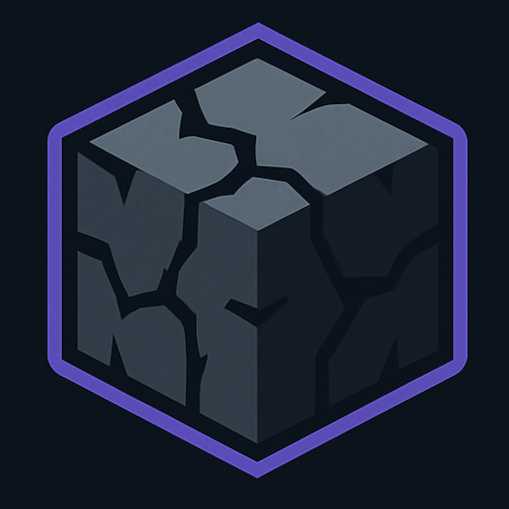

<br>

<div align="center">
  <kbd>
    
  </kbd>

  # Cubix
  An open source server software written in C++ for Minecraft: Bedrock Edition.
</div>

> [!NOTE]
> Please do not use in production, as Cubix is in its very early stages and is essentially incomplete.

## License
This project is open-source under the **GNU General Public License v3.0 (GPL-3.0)** — see [LICENSE](./LICENSE.md) for details.

You are free to use, modify, and distribute this software, as long as any derivative works are also licensed under the GPL-3.0.

## Contributing
```shell
# Fork the repository
git clone https://github.com/DarkGamerYT/Cubix.git

# Create a new branch
git checkout -b feature-branch

# Commit your changes
git commit -m "Added new feature"

# Push to GitHub
git push origin feature-branch

# Submit a Pull Request
```
